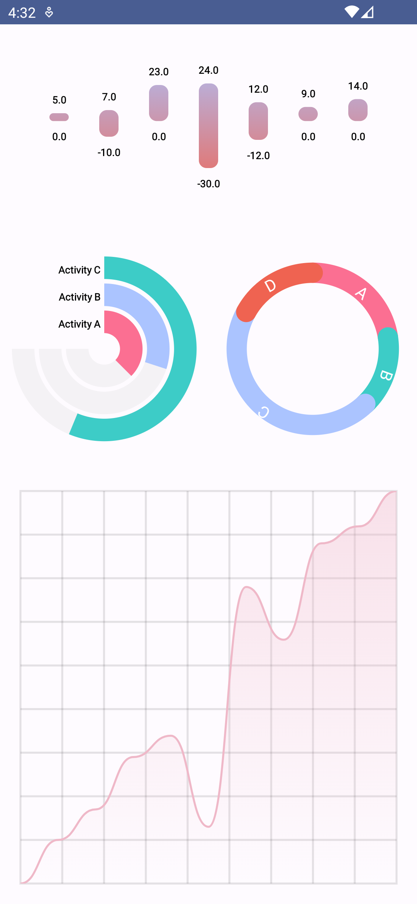

# PlotWizard

This is a simple chats library made with Jetpack compose
[]

## Features

- [x] Line Chart
- [x] Pie Chart
- [x] Range Chart

## Todo

- [ ] Spiral Chart
- [ ] Area Chart
- [ ] Column Chart
- [ ] Group Chart
- [ ] Gauge Chart

## In Progress

- [ ] Spiral Chart

## Done

- [x] Line Chart
- [x] Pie Chart
- [x] Range Chart


## Installation
Add it in your root build.gradle at the end of repositories:

```groovy
allprojects {
		repositories {
			...
			maven { url 'https://jitpack.io' }
		}
	}
```
build.gradle (app)
```groovy
dependencies {
    implementation 'com.github.md0092651:PlotWizard:0.0.2'
}
```

## Development

This app is developed using Kotlin and Jetpack Compose.

## Contributing

Contributions to this project are welcome. If you find a bug or would like to suggest a new feature,
please open an issue on this repository.

## Current Progress

<p align="center">
  <table>
    <tr>
      <td>
        
        <br>
        <em>Step1</em>
      </td>
      <td>
        
        <br>
       <em>Step2</em>
      </td>
        <td>
        
        <br>
            <em>Step3</em>
      </td>
    </tr>
    <tr>
        <td>
            
            <br>
            <em>Step4</em>
        </td>
        <td>
            
            <br>
            <em>Step5</em>
        </td>
        <td>
            
            <br>
            <em>Step6</em>
        </td>
    </tr>
    <tr>
        <td>
            
            <br>
            <em>Step7</em>
        </td>
    </tr>
  </table>


## License

This project is licensed under the [MIT License](LICENSE).

